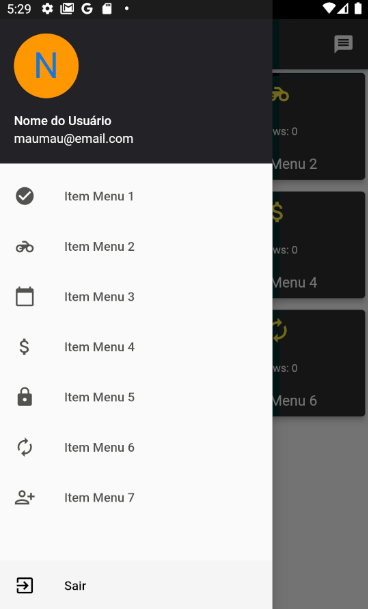
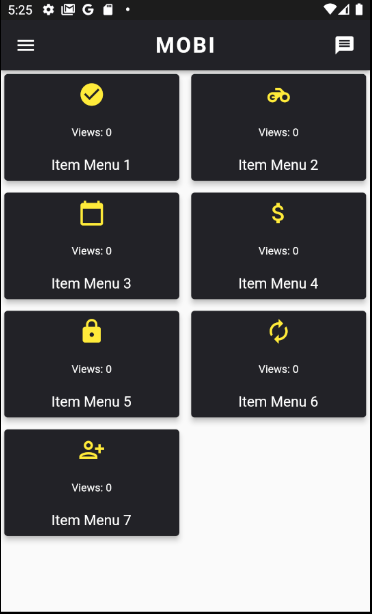

# Flutter App

Este projeto é uma aplicação simples de login criada com o Flutter. Ele é feito para fornecer um exemplo básico de como se pode usar o Flutter para criar aplicativos móveis.

  
  
  

## Recursos

- Tela de Login

- usuário valido para login:
- email: maumau@email.com
- senha: 123

- Autenticação de usuário
- Persistência de dados com SharedPreferences
- Design agradável e responsivo

## Instruções de Instalação

**Pré-requisitos:**
- Flutter 3.10.2
- Tools • Dart 3.0.2 • DevTools 2.23.1
- java version "17.0.7"
- Ter o Flutter e Dart instalados em sua máquina. [Siga estas instruções se você ainda não tem o Flutter configurado.](https://flutter.dev/docs/get-started/install)

**Pré-requisitos:**

- esse projeto se comunica com uma api nodejs em execução na aws.
(https://github.com/MauricioGoulartt/Api-RestFUL_NodeMongoExpress)

**Passos para instalação:**

1. Clone este repositório usando `git clone https://github.com/MauricioGoulartt/FlutterApp.git`.
2. Navegue até o diretório do projeto: `cd FlutterApp`.
3. Instale as dependências do projeto: `flutter pub get`.
4. Inicie um emulador Android ou iOS, ou conecte um dispositivo físico à sua máquina.
5. Execute o aplicativo: `flutter run`.

## Como usar

Após a instalação, você será recebido com uma tela de login. Você pode preencher as credenciais e clicar em "Login". Se a autenticação for bem-sucedida, você será direcionado para a página inicial. Se falhar, você verá uma mensagem de erro.

## Suporte

Se você encontrar algum problema, sinta-se à vontade para abrir uma issue [aqui](https://github.com/MauricioGoulartt/FlutterApp/issues). Tente incluir o máximo de detalhes possível para que possamos ajudá-lo melhor.

## Contribuição

Agradecemos todas as contribuições. Se você deseja contribuir para este projeto, siga os passos a seguir:

1. Faça um Fork deste repositório.
2. Crie uma Branch (`git checkout -b feature/AmazingFeature`).
3. Faça um Commit das suas alterações (`git commit -m 'Add some AmazingFeature'`).
4. Faça um Push para a Branch (`git push origin feature/AmazingFeature`).
5. Abra uma Pull Request.

## Licença

Este projeto está licenciado sob a Licença MIT - consulte o arquivo [LICENSE](LICENSE) para obter detalhes.

## Contato

Nome: Mauricio Goulart
Email: mauriciogoulart.1990@gmail.com
GitHub: https://github.com/MauricioGoulartt

---

Este README foi criado com ❤️ por [Mauricio Goulart](https://github.com/MauricioGoulartt)
